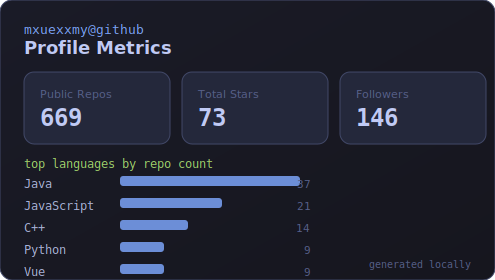

<div align="center">

### Hi, I'm mxuexxmy (玄兴梦影)

> Code is life, poetry is spirit. Be a poetic engineer.  
> 代码是生活，诗歌是精神。做一个诗意的工程师。

`Full-stack` · `Industrial Internet` · `LazyCat MicroServer` · `Kunming, China`  
`全栈` · `工业互联网` · `懒猫微服` · `昆明`

[](https://infoq.cn/u/mxuexxmy/)
[](https://twitter.com/mxuexxmy)
[](https://github.com/mxuexxmy)

</div>

---

## About / 关于

I'm a full-stack engineer at **Hualong Xunda**, building systems for the industrial internet.  
我在 **华龙讯达** 从事工业互联网相关的全栈开发。

Most of my work centers on **Java / Spring** backends, with **Vue / TypeScript** on the frontend. I also explore **LazyCat MicroServer** ecosystem apps and **AI agent tooling**.

Outside of code, I write poetry and essays — trying to keep engineering and language in the same breath.

---

## Now Building / 正在构建

<!-- profile:start:now-building -->
| Project | Tags | Lang | Stars | Updated | Description / 简介 |
| --- | --- | --- | ---: | --- | --- |
| [awesome-LazyCat-Microserver](https://github.com/mxuexxmy/awesome-LazyCat-Microserver) | `LazyCat` `Ecosystem` | — | 5 | 2026-06-10 | Curated resources for LazyCat MicroServer / 懒猫微服资源大全 |
| [BiliNote-lzc-app](https://github.com/mxuexxmy/BiliNote-lzc-app) | `LazyCat` `AI` | — | 3 | 2025-06-29 | BiliNote packaged as a LazyCat MicroServer app / BiliNote 懒猫微服应用 |
| [lazycat-app](https://github.com/mxuexxmy/lazycat-app) | `LazyCat` `Vue` | Vue | 2 | 2025-07-28 | LazyCat application development workspace / 懒猫微服应用开发 |
| [xifeng-style-writer](https://github.com/mxuexxmy/xifeng-style-writer) | `AI` `Agent` | — | 1 | 2026-04-24 | Writing-style SKILL for AI agents / 西风/记忆承载风格 AI Agent Skill |
| [printing-service](https://github.com/mxuexxmy/printing-service) | `Java` `Full-stack` | Java | 1 | 2025-07-04 | Backend service for Rongrong Print / 荣荣打印后端服务 |
| [professions](https://github.com/mxuexxmy/professions) | `Java` `Education` | HTML | 3 | 2024-08-21 | Major curriculum management system / 专业培养方案管理系统 |
<!-- profile:end:now-building -->

<!-- profile:start:maintenance -->
> Profile metrics auto-refreshed via GitHub Actions · 数据自动更新于 **2026-07-24 08:20 UTC**
<!-- profile:end:maintenance -->

---

## Focus / 当前方向

```text
Industrial Systems   Java · Spring · Vue · Docker
LazyCat Ecosystem    MicroServer apps · lpk packaging · Traefik routing
AI Tooling           Agent skills · writing workflows · automation
Engineering + Words  code by day, poetry by night
```

---

## Tech Stack / 技术栈


---

## Featured Projects / 精选项目

| Project | Description / 简介 |
| --- | --- |
| [awesome-LazyCat-Microserver](https://github.com/mxuexxmy/awesome-LazyCat-Microserver) | Awesome list for LazyCat MicroServer / 懒猫微服资源大全 |
| [BiliNote-lzc-app](https://github.com/mxuexxmy/BiliNote-lzc-app) | BiliNote as a LazyCat MicroServer app |
| [lazycat-app](https://github.com/mxuexxmy/lazycat-app) | LazyCat application development |
| [professions](https://github.com/mxuexxmy/professions) | Major curriculum management system / 专业培养方案管理系统 |
| [printing](https://github.com/mxuexxmy/printing) · [printing-service](https://github.com/mxuexxmy/printing-service) | Rongrong Print — full-stack printing solution / 荣荣打印 |
| [xifeng-style-writer](https://github.com/mxuexxmy/xifeng-style-writer) | Writing-style SKILL for AI agents |
| [query-name](https://github.com/mxuexxmy/query-name) | Name lookup tool / 查询鼎鼎大名 |
| [2019HolidaysTrain](https://github.com/mxuexxmy/2019HolidaysTrain) | 2019 summer ICPC training notes — **selected for the [GitHub Archive Program](https://archiveprogram.github.com/) (2020)** |

<details>
<summary><b>More repositories / 更多仓库</b></summary>

- [love-story](https://github.com/mxuexxmy/love-story)
- [CollectionOfBooks](https://github.com/mxuexxmy/CollectionOfBooks) — curated book list
- [Translate-3-2-1-newsletter](https://github.com/mxuexxmy/Translate-3-2-1-newsletter)
- [dream-ui](https://github.com/mxuexxmy/dream-ui) · [dream-mobile-ui](https://github.com/mxuexxmy/dream-mobile-ui) — college entrance exam score management
- [learn-labs](https://github.com/mxuexxmy/learn-labs) — learning experiments

</details>

---

## Writing & Poetry / 写作与诗歌

**Essays / 文章**

- [人在路上·梦在途中](https://mp.weixin.qq.com/s/NFxldytnuXslYPxSfKOIhQ) — WeChat essay / 微信公众号

**Poetry · 玄兴梦影** *(poetic pen name / 诗歌笔名)*

[梦幻九月](https://mp.weixin.qq.com/s?src=11&timestamp=1606197141&ver=2725&signature=eVVMhOoXHfNQtvv0qraNOFROXH97DpZR6il-qn77HZRb-uR47QLhop2*xpwmEcj4ZazcIGVS0v8MyPbEMSIHPUh2fWCmefl5NSrCSId65r866nMF-hLHjhC2fdLVsxzs&new=1) · [偷时光](https://www.sohu.com/a/271410642_581694) · [我见过的唯一月亮](http://mini.eastday.com/a/180627132001527.html) · [父亲](https://www.sohu.com/a/236518971_581694) · [程序员的秋](http://www.zgshige.com/c/2018-10-25/7503696.shtml) · [与树说诗的程序员](http://www.zgshige.com/c/2018-10-09/7347609.shtml)

<details>
<summary><b>More poems / 更多诗歌</b></summary>

- [雨说](https://www.sohu.com/a/239588684_581694)
- [醒梦人生](https://new.qq.com/omn/20180619/20180619A1ZVC7.html)
- [我愿在你身旁](http://www.zgshige.com/c/2019-04-09/9105096.shtml)
- [深夜，生活面见我](https://www.jianshu.com/p/e7b50e0f9d72)
- [相约德溪](http://www.zgshige.com/c/2019-04-09/9104987.shtml)
- [腊八节，在黔西](http://www.zgshige.com/c/2019-02-13/8529513.shtml)
- [偶然](http://www.zgshige.com/c/2018-10-25/7501381.shtml)
- [写给夜](http://www.zgshige.com/c/2018-10-09/7352363.shtml)
- [医生](http://www.zgshige.com/c/2018-09-23/7230637.shtml)
- [致军人](http://www.zgshige.com/c/2018-09-22/7213365.shtml)
- [致新颖或一群奋斗的人](http://www.zgshige.com/c/2018-09-20/7204886.shtml)
- [兄弟，今夜什么都不说](http://www.zgshige.com/c/2018-09-17/7159755.shtml)
- [七星关纪事·关关有情](http://www.zgshige.com/c/2018-09-10/7126042.shtml)
- [今夜，我一人或致室友](http://www.zgshige.com/c/2018-09-05/7075315.shtml)
- [我把爱丢了](http://www.zgshige.com/c/2018-09-02/7058672.shtml)
- [小窗](http://www.zgshige.com/c/2018-09-02/7058606.shtml)

**Poetry · 沐雪程序员** *(programmer pen name / 程序员笔名)*

- [编程式爱情](https://www.sohu.com/a/281021777_284898)

</details>

---

## Profile Metrics / 数据概览



---

<div align="center">

*"Between commits and verses, I keep building."*  
*在提交与诗句之间，持续建造。*

</div>
