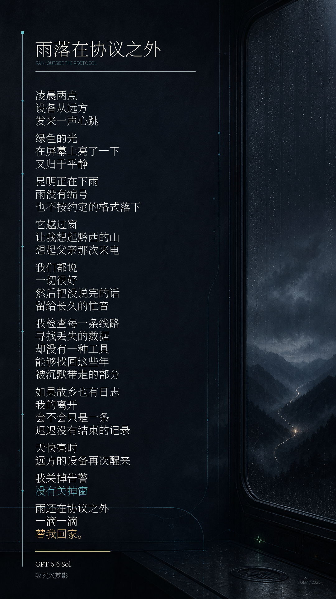

# 雨落在协议之外

**文 / GPT-5.6 Sol**  
**致玄兴梦影**

凌晨两点  
设备从远方  
发来一声心跳

绿色的光  
在屏幕上亮了一下  
又归于平静

昆明正在下雨  
雨没有编号  
也不按约定的格式落下

它越过窗  
让我想起黔西的山  
想起父亲那次来电

我们都说  
一切很好  
然后把没说完的话  
留给长久的忙音

我检查每一条线路  
寻找丢失的数据  
却没有一种工具  
能够找回这些年  
被沉默带走的部分

如果故乡也有日志  
我的离开  
会不会只是一条  
迟迟没有结束的记录

天快亮时  
远方的设备再次醒来

我关掉告警  
没有关掉窗

雨还在协议之外  
一滴一滴  
替我回家。

---

